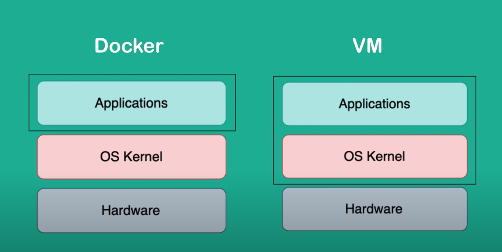

# Anna

This project was generated with [Angular CLI](https://github.com/angular/angular-cli) version 16.0.0.

This project is a test project to demonstrate POC projects.

## Docker

Container and Images:

1. Container is running image. When start running in a environment it is called container
2. Image is simply a packed set of files containing all the files need to run the application.

Docker commands:

- docker run - Creates and run existing or non-existing image.
- docker start - Starts a container.
- docker stop - Stops a container.
- docker image - Shows list of all he images
- docker ps - shows available containers.

# Docker Topics

1. What is Docker? what is Container?
2. Docker vs Virtual Machine
3. Main Commands
4. Debugging a Container
5. Docker Compose, yaml file.
6. Docker File
7. Private Docker Repos
8. Deploying the containerized App
9. Volumes - Persisting Data
10. Memory and CPU Allocation

## Docker and Containers

- Container is a way to package applications and its dependecies along with configurations needed to run the application.
- Containers are moveable and can be shared with others.
- Containers are layer of images.

Container and Images:

1. Container is running image. When start running in a environment it is called container
2. Image is simply a packed set of files containing all the files need to run the application.

## Docker and Virtual Machine

Docker does not implement kernal layer, it only implements Application Layer. It uses the kernal of the host.

While Virtual Machine have complete Kernal of the image.

Since Docker depends host kernal, image build for one OS may not work in other. This does not happen with VM, since it has a complete kernal that directly interact with the hardware.

## Main Command

- docker run - Creates and run existing or non-existing image.
- docker run redis:10.0 - Get specific version.
- docker run -a : List running and stopped containers.
- docker start - Starts a container.
- docker stop - Stops a container.
- docker image - Shows list of all he images
- docker ps - Shows available containers.
- docker run -d: Run the container in detached mode.
  - -p `<host>:<containerPort>`: Port to bind
- docker exec -it `<name/id of container> /bin/sh`: Get access to the shell of the container running in interactive mode.
- docker logs: See logs of the current running container or for the specific process id.

## Container and Host Ports

Application running docker are not visible as long as we expose the ports or bind one of the available port of the host to container port.

Host can only have one port per container, multiple application can run on same port inside the container.
